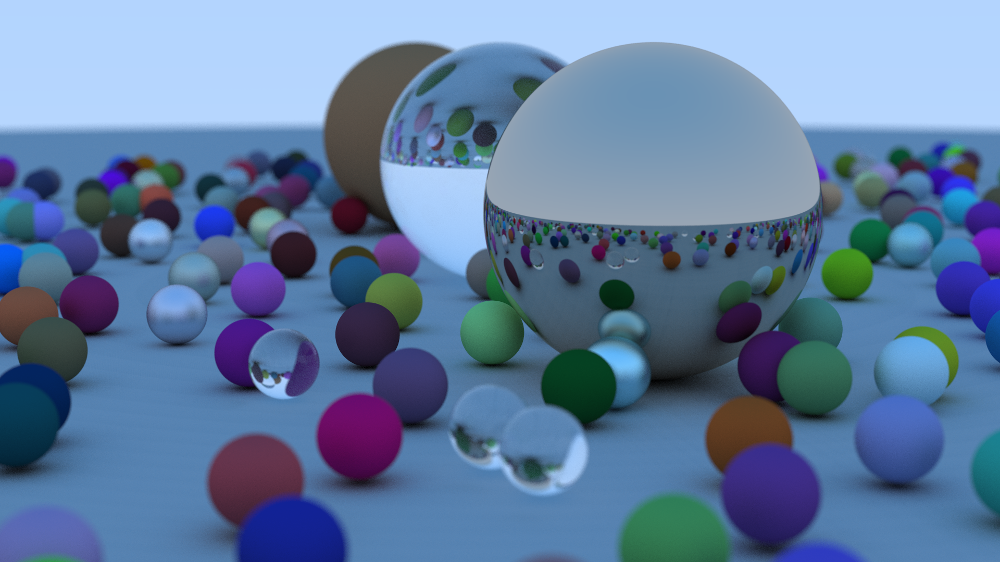

# Raytracing

This project is an implementation and follow through of the [Ray Tracing in a Weekend](https://raytracing.github.io/books/RayTracingInOneWeekend.html) series (specifically the first book). This is my first finished graphics-related project with more coming soon hopefully.



## Getting Started

### Project Setup

```
Raytracing/
├── resources/
│   └── rtk.png
├── src/
│   ├── Error/ <----------------------- Error module
│   │   └── BaseError.hpp
│   ├── Renderer/ <-------------------- The rendering and graphics module
│   │   ├── Error.cpp
│   │   ├── Error.hpp
│   │   ├── Image.cpp
│   │   ├── Image.hpp
│   │   ├── Ray.hpp
│   │   ├── Renderer.cpp
│   │   └── Renderer.hpp
│   ├── Scene/ <----------------------- Scene and related modules
│   │   ├── Materials/ <--------------- Different materials to be used in scenes
│   │   │   ├── Dielectric.cpp
│   │   │   ├── Dielectric.hpp
│   │   │   ├── HitRecord.hpp
│   │   │   ├── Lambertian.cpp
│   │   │   ├── Lambertian.hpp
│   │   │   ├── Material.hpp
│   │   │   ├── Materials.hpp
│   │   │   ├── Metal.cpp
│   │   │   └── Metal.hpp
│   │   ├── Camera.cpp
│   │   ├── Camera.hpp
│   │   ├── Scene.cpp
│   │   ├── Scene.hpp
│   │   ├── Sphere.cpp
│   │   └── Sphere.hpp
│   ├── Config.cpp
│   ├── Config.hpp
│   ├── EntryPoint.cpp <--------------- Main function lives here
│   ├── Random.cpp
│   ├── Random.hpp
│   ├── Timer.cpp
│   └── Timer.hpp
├── vendor/ <-------------------------- This is where we put out libraries
│   ├── fpng/
│   └── glm/
├── compile_flags.txt
├── Makefile
└── README.md
```

### Building

1. Clone the project to the directory of choice:
```bash
git clone https://github.com/RCK1439/Raytracing.git
```

2. Compile the project with `make`:
```bash
make release
```

### Running

Running the program is quite simple; simply execute the following in the project root directory:
```bash
./bin/rtk
```

#### Additional arguments

 - ```-s``` or ```-S```: This specifies the resolution of the image to output. (e.g. ```-s 1280 720```)
 - ```-a``` or ```-A```: This specifies the anti-aliasing number of samples. (e.g. ```-a 32```)
 - ```-d``` or ```-D```: This specifies the amounts of bounces a ray can have. (e.g. ```-d 8```)
 - ```-o```: This specifies the output directory to save the rendered image to. (e.g. ```-o path/to/dir/name.png```)
 - ```-help```: Shows a little help menu in the terminal that describes the valid input arguments. (e.g. ```-help```)

Try the following:
```bash
./bin/rtk -s 1280 720 -a 128 -d 50
```

## Dependencies

 - [fpng](https://github.com/richgel999/fpng)
 - [glm](https://github.com/g-truc/glm)
